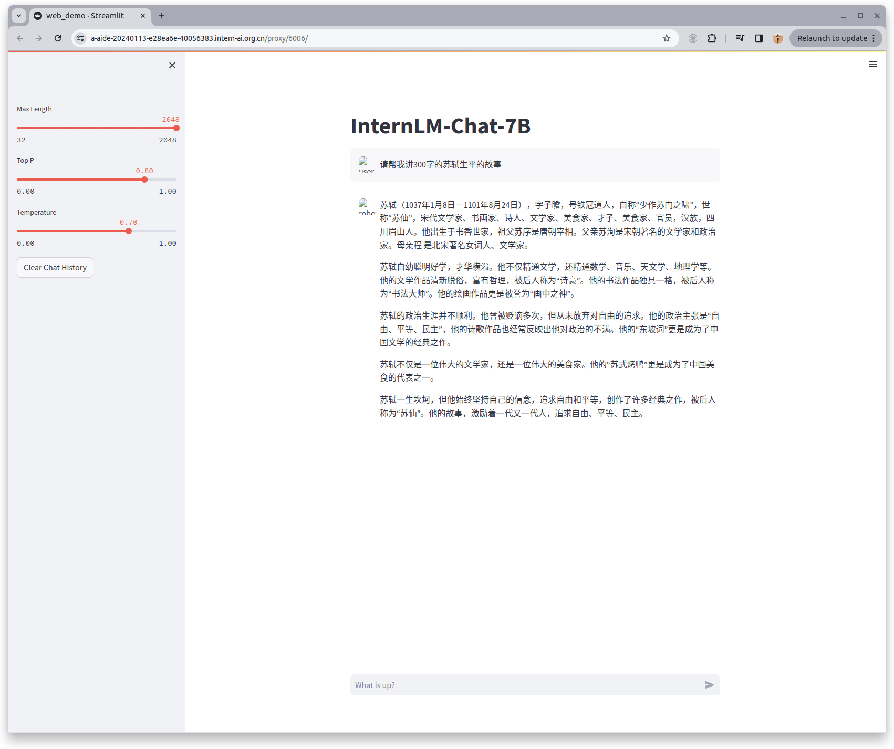
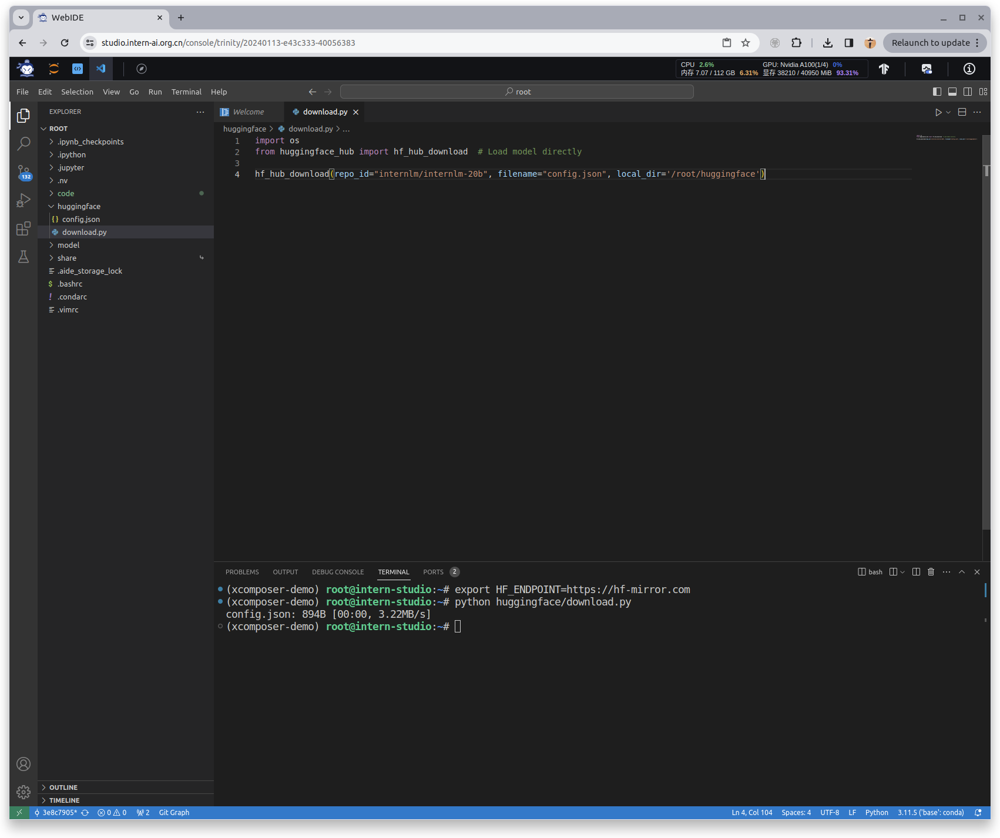
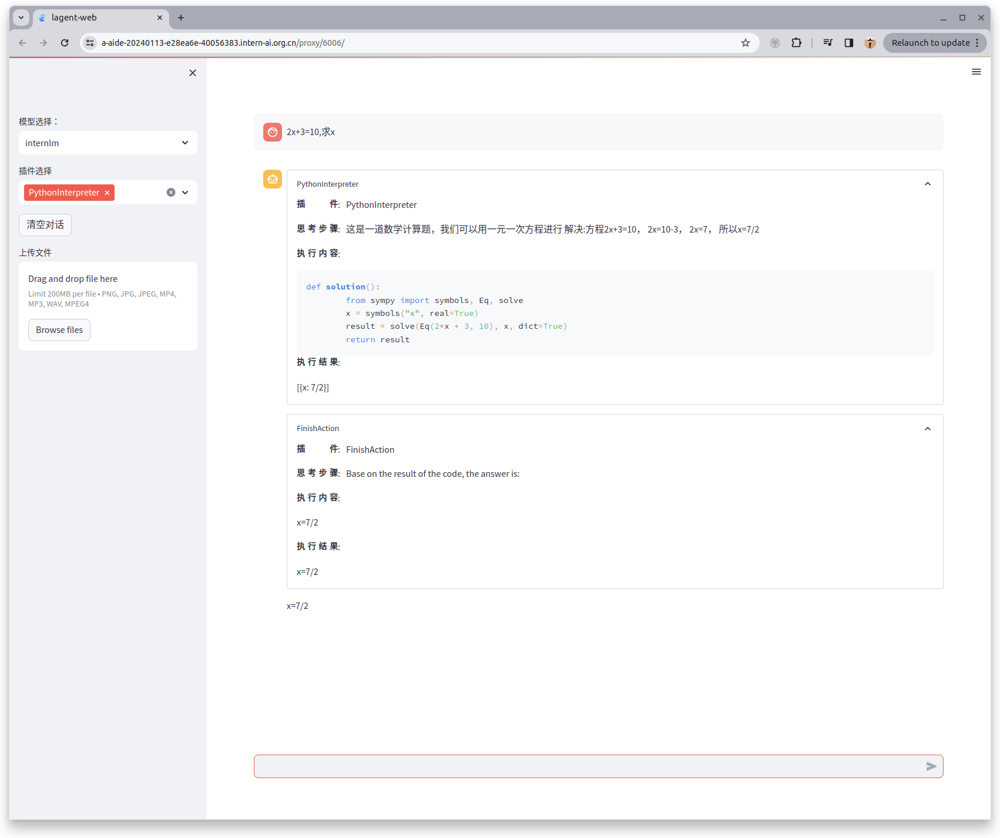
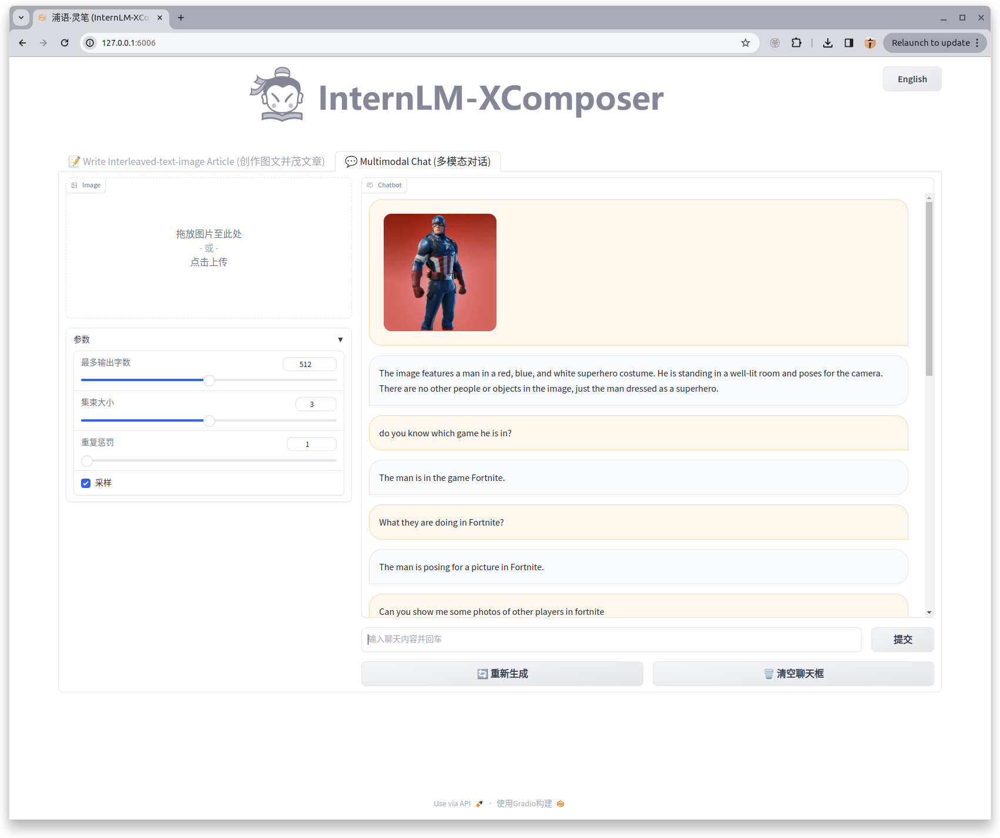
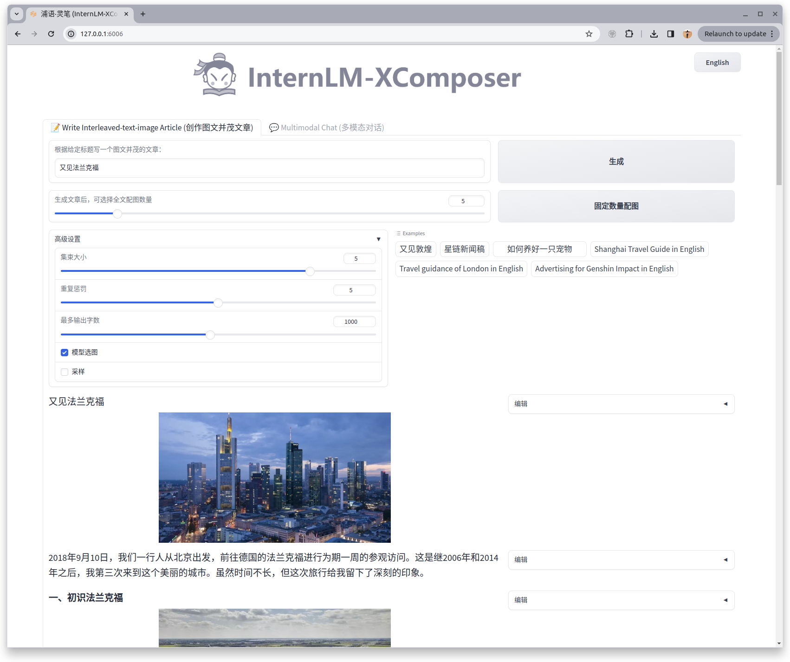
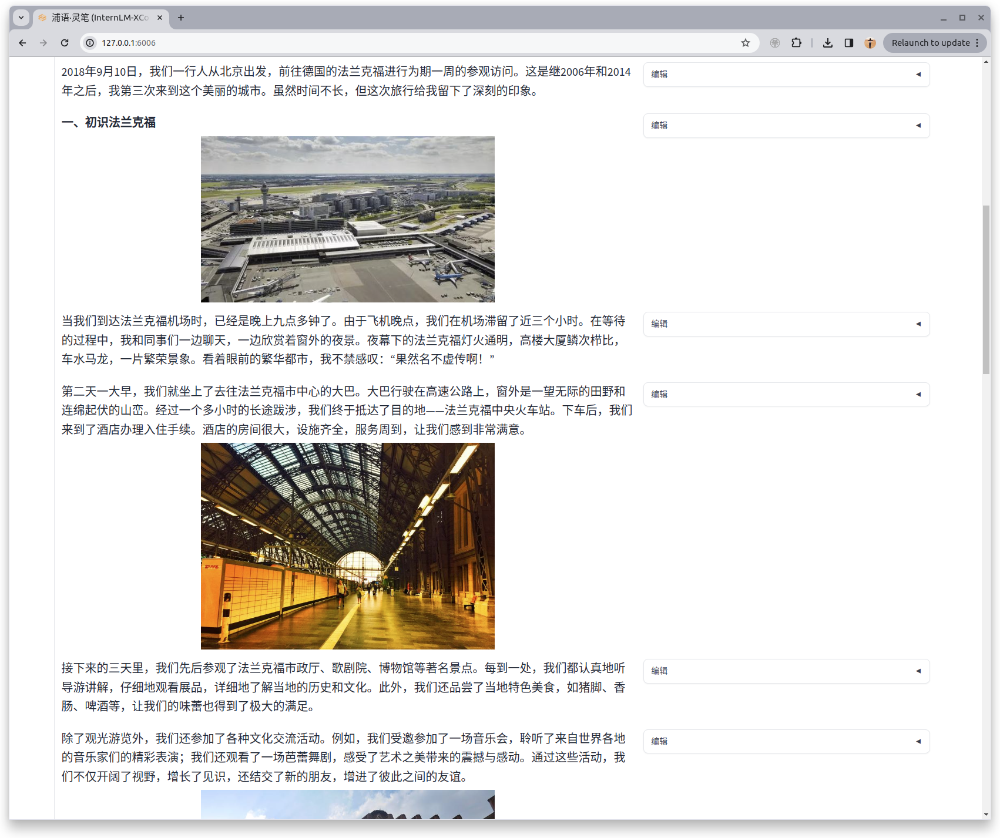

## Basic Homework

1. InternLM-Chat智能对话Demo

2. Familiar with hugging face function, use `huggingface_hub python` to download `InternLM-20B` and `config.json`

## Advanced Homwork

1. Lagent智能体工具调用Demo

2. 浦语·灵笔图文理解创作 Demo 1

3. 浦语·灵笔图文理解创作 Demo 2

参考下面生成的文章
> [又见法兰克福](images/io.md)