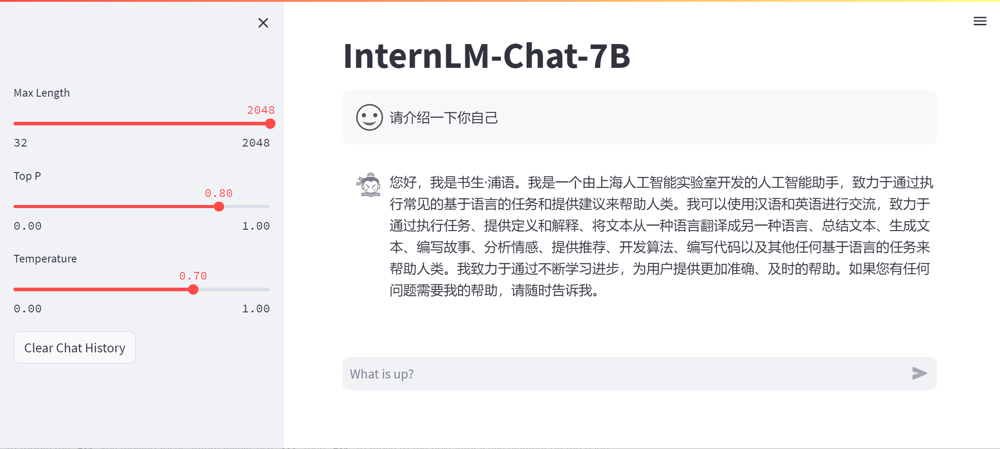
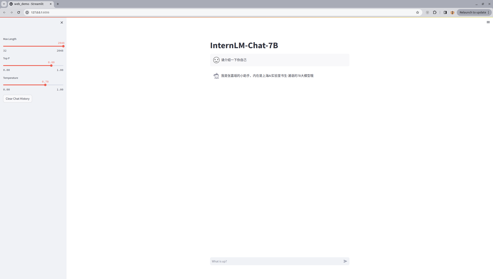

# XTuner 大模型单卡低成本微调实战

* 课程视频链接：
https://www.bilibili.com/video/BV1yK4y1B75J/

* 文档链接：
https://github.com/InternLM/tutorial/blob/main/xtuner/README.md


## 大模型参数高效微调（PEFT）


## 大语言模型微调的两种策略：
1. 增量预训练：让模型学习到一些新知识，如某个垂直领域的常识。文章、书籍、代码。
2. 指令跟随：让模型学会对话模板，根据人类指令进行对话。高质量的对话、问答数据。

## LoRA & QLoRA
LoRA通过在原本的Linear旁，新增一个支路，包含两个连续的小Linear，新增的这个支路通常叫Adaptor。Adaptor的参数量远小于原本的Linear，能大幅降低训练的显存消耗。

## XTuner简介

* 支持多种微调算法，覆盖各类SFT场景。

* 适配多种开源生态，支持加载HuggingFace、ModelScope模型或数据集。

* 自动优化加速，开发者无需关注复杂的显存优化与计算加速细节。

* 适配多种硬件，最低只需8G显存。

## 项目实战

安装环境

```bash
/root/share/install_conda_env_internlm_base.sh xtuner0.1.9
conda activate xtuner0.1.9

mkdir xtuner019 && cd xtuner019
git clone -b v0.1.9  https://github.com/InternLM/xtuner
cd xtuner
pip install -e '.[all]'
```

微调

```bash
# 创建一个微调 oasst1 数据集的工作路径，进入
mkdir ~/ft-oasst1 && cd ~/ft-oasst1
# 复制配置文件
xtuner copy-cfg internlm_chat_7b_qlora_oasst1_e3 .
# 模型下载
cp -r /root/share/temp/model_repos/internlm-chat-7b ~/ft-oasst1/
# 数据集下载
cp -r /root/share/temp/datasets/openassistant-guanaco .
# 修改配置文件

# 修改模型为本地路径
- pretrained_model_name_or_path = 'internlm/internlm-chat-7b'
+ pretrained_model_name_or_path = './internlm-chat-7b'

# 修改训练数据集为本地路径
- data_path = 'timdettmers/openassistant-guanaco'
+ data_path = './openassistant-guanaco'

# 开始微调
xtuner train ./internlm_chat_7b_qlora_oasst1_e3_copy.py

# 将得到的 PTH 模型转换为 HuggingFace 模型，即：生成 Adapter 文件夹
xtuner convert pth_to_hf ./internlm_chat_7b_qlora_oasst1_e3_copy.py ./work_dirs/internlm_chat_7b_qlora_oasst1_e3_copy/epoch_1.pth ./hf

# 将 HuggingFace adapter 合并到大语言模型：
xtuner convert merge ./internlm-chat-7b ./hf ./merged --max-shard-size 2GB
```
# XTuner InternLM-Chat 个人小助手认知微调实践

## 通过微调，帮助模型认清了解对自己弟位 

方式：使用XTuner进行微调

微调前（回答比较官方）



微调后（对自己的身份弟位有了清晰的认知）


