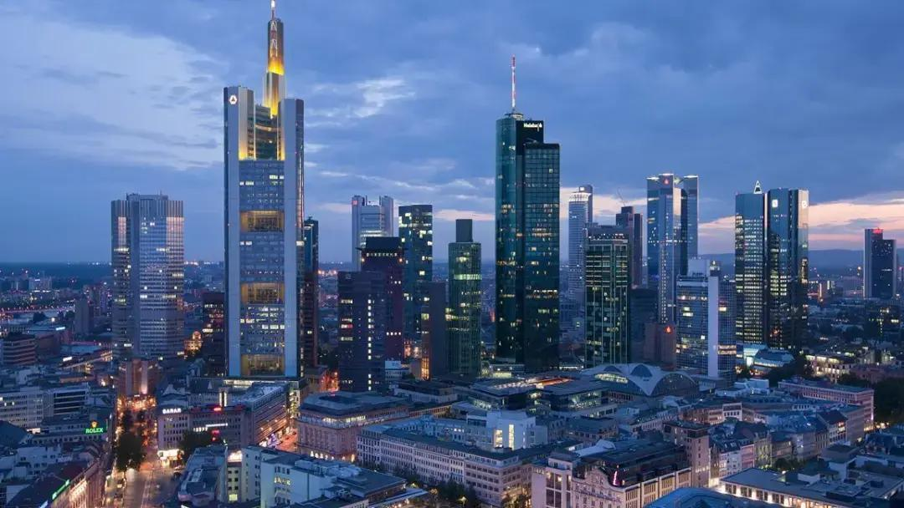
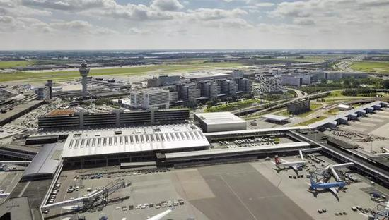
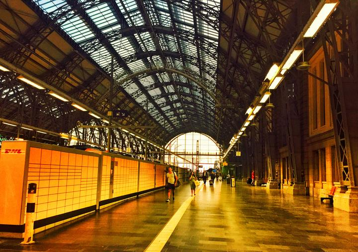
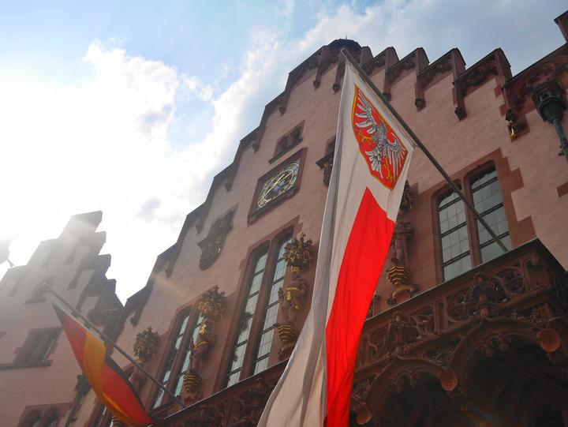
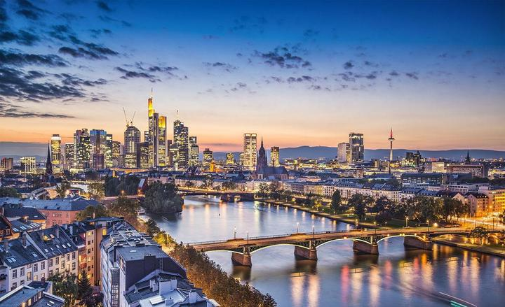
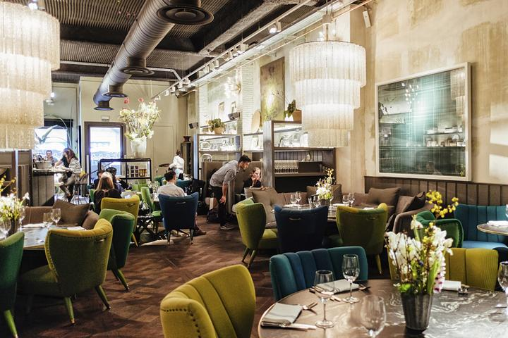
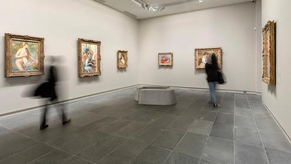

又见法兰克福

  

2018年9月10日，我们一行人从北京出发，前往德国的法兰克福进行为期一周的参观访问。这是继2006年和2014年之后，我第三次来到这个美丽的城市。虽然时间不长，但这次旅行给我留下了深刻的印象。

**一、初识法兰克福**

  

当我们到达法兰克福机场时，已经是晚上九点多钟了。由于飞机晚点，我们在机场滞留了近三个小时。在等待的过程中，我和同事们一边聊天，一边欣赏着窗外的夜景。夜幕下的法兰克福灯火通明，高楼大厦鳞次栉比，车水马龙，一片繁荣景象。看着眼前的繁华都市，我不禁感叹：“果然名不虚传啊！”

第二天一大早，我们就坐上了去往法兰克福市中心的大巴。大巴行驶在高速公路上，窗外是一望无际的田野和连绵起伏的山峦。经过一个多小时的长途跋涉，我们终于抵达了目的地——法兰克福中央火车站。下车后，我们来到了酒店办理入住手续。酒店的房间很大，设施齐全，服务周到，让我们感到非常满意。

  

接下来的三天里，我们先后参观了法兰克福市政厅、歌剧院、博物馆等著名景点。每到一处，我们都认真地听导游讲解，仔细地观看展品，详细地了解当地的历史和文化。此外，我们还品尝了当地特色美食，如猪脚、香肠、啤酒等，让我们的味蕾也得到了极大的满足。

除了观光游览外，我们还参加了各种文化交流活动。例如，我们受邀参加了一场音乐会，聆听了来自世界各地的音乐家们的精彩表演；我们还观看了一场芭蕾舞剧，感受了艺术之美带来的震撼与感动。通过这些活动，我们不仅开阔了视野，增长了见识，还结交了新的朋友，增进了彼此之间的友谊。

  

离开法兰克福的那一天，我们依依不舍地告别了这个美丽而充满活力的城市。在这里，我们度过了愉快的时光，留下了许多美好的回忆。我相信，这将是我们一生中最珍贵的财富之一。

**二、再访法兰克福**

  

转眼间，已经过去了四年。在这四年里，我曾多次回想起那次难忘的旅行，并一直期待着有朝一日能够再次踏上这片土地。如今，我的愿望终于实现了。

今年夏天，我又一次来到了法兰克福。不同的是，这一次我是以游客的身份来这里旅游的。尽管如此，我却依然感受到了这座城市的独特魅力。

  

首先，我要赞叹一下法兰克福的交通系统。无论是地铁、轻轨还是公交车，都运行得非常准时且舒适。另外，这里的出租车也很方便，价格也比较合理。总之，无论你是乘坐哪种交通工具，都能轻松快捷地到达你想去的地方。

其次，我也要夸奖一下法兰克福的美食。这里的餐厅种类繁多，口味各异，足以满足不同人的需求。其中，我最喜欢的一家餐厅是一家名为“Brauerei Hacker-Pschorr”的啤酒屋。在那里，你可以品尝到正宗的德国啤酒和各种美味的小吃，让人流连忘返。

  

最后，我还想谈谈法兰克福的文化氛围。在这个城市里，你随处都可以感受到浓郁的文艺气息。无论是街头巷尾的艺术画廊，还是各大博物馆里的珍贵藏品，都吸引着众多游客前来参观。除此之外，还有各种音乐节、戏剧演出以及展览会等活动，为人们提供了丰富的文化娱乐选择。

总之，再一次来到法兰克福，让我更加深刻地体会到了这座城市的魅力所在。它不仅是一座现代化的国际大都市，也是一座历史悠久、文化底蕴深厚的历史文化名城。如果你有机会来到这里，相信你也会和我一样，被它的风采所折服。

  

